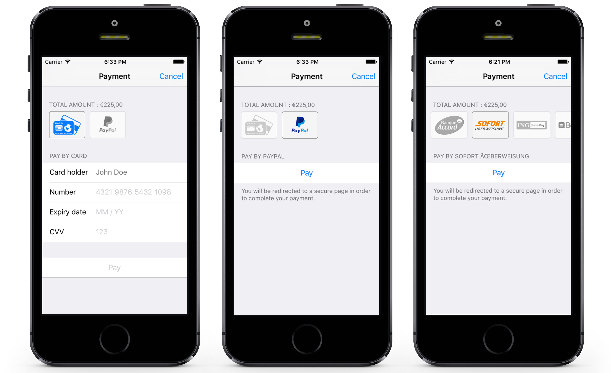

# HiPay SDK for iOS

The **HiPay SDK for iOS** is a library that allows you to **accept payments in your iOS application** by leveraging the HiPay payment platform. The library is written in Objective-C and is based on Cocoa Touch. This repository contains the SDK as well as a demo application allowing you to generate a simple payment screen and demonstrating how to use the SDK.

## Getting started

Read the **[iOS documentation][doc-home]** for comprehensive information about the requirements, general workflow and installation procedure.

## Resources
- [iOS documentation][doc-home] — To have a comprehensive understanding of the workflow and get the installation procedure
- [HiPay Support Center][hipay-help] — To get technical help from HiPay
- [Issues][project-issues] — To report issues, submit pull requests and get involved (see [Apache 2.0 License][project-license])
- [Change log][project-changelog] — To check the changes of the latest versions
- [Contributing guidelines][project-contributing] — To contribute to our source code

## Features

- Allows you to accept payments in your iOS app with many payment methods: international credit and debit cards (Visa, MasterCard, American Express, Maestro, etc.), e-wallets (PayPal, Qiwi Wallet, etc.), prepaid cards, realtime banking, …
- Wraps the HiPay REST API for easy communication between your iOS application and the payment platform
- Presents a **native payment screen** optimized for iPhone and iPad devices
- **Native** support for many payment methods, including most of the payment cards

## License

The **HiPay SDK for iOS** is available under the **Apache 2.0 License**. Check out the [license file][project-license] for more information.

[doc-home]: https://developer.hipay.com/doc/hipay-enterprise-sdk-ios/

[hipay-help]: https://support.hipay.com/hc/fr

[project-issues]: https://github.com/hipay/hipay-fullservice-sdk-ios/issues

[project-license]: LICENSE.md
[project-changelog]: CHANGELOG.md
[project-contributing]: CONTRIBUTING.md
